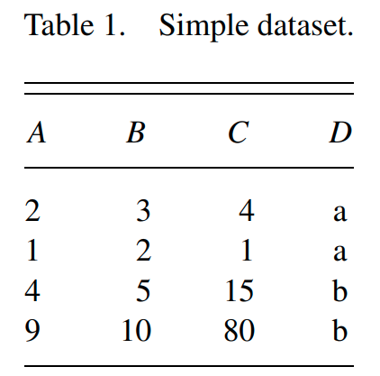
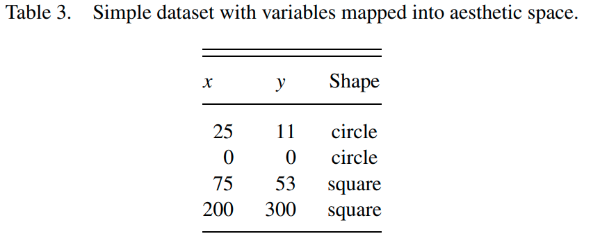
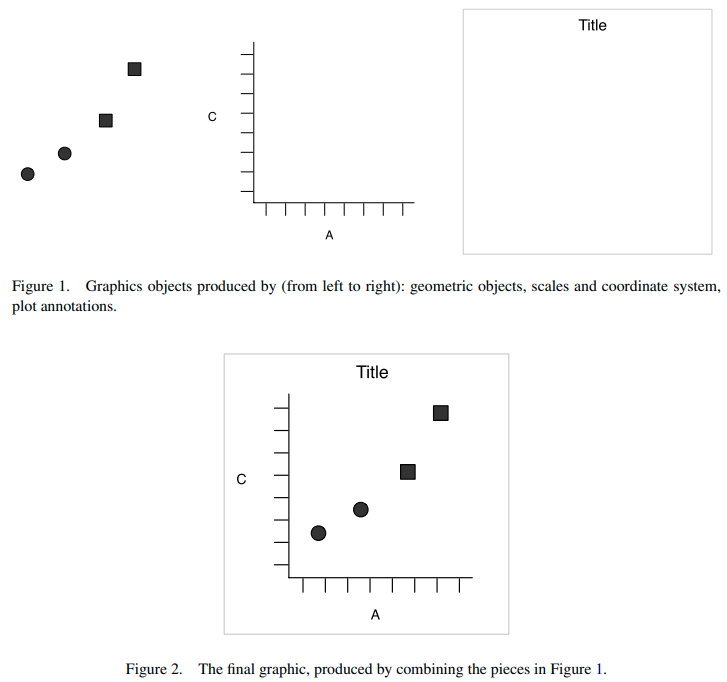

```{r setup, include=FALSE, warning=FALSE}
options(htmltools.dir.version = FALSE)
library(knitr)
library(tidyverse)
library(rmarkdown)
opts_chunk$set(echo = FALSE, warning = FALSE,
               message = FALSE)

library(xaringanthemer)
style_duo_accent(
  primary_color = "#082551",
  secondary_color = "#cee6f5",
  inverse_header_color = "#FFFFFF",
  title_slide_text_color = "#FFFFFF",
  text_font_google = google_font("Roboto"),
  header_font_google = google_font("Miriam Libre")
)

xaringanExtra::use_xaringan_extra(c(
  "tile_view", "editable", "animate_css",
  "clipboard", "tachyons"
))
```

<style>
blockquote {
  background-color: var(--secondary);
  border-radius: 10px;
}
.caption {
 color: #404040;
}
</style>


## A Data Analysis Workflow

.center.mt6[
```{r workflow-graphic, out.width='50%', fig.cap="Source [1]"}
include_graphics("img/workflow-wickham.png")
```
]

---

## The Tidyverse

```{r}
include_url("https://www.tidyverse.org/")
```

---
class: middle, center

# Tidy Data

---

## Tidy Data

> »Happy families are all alike;<br>
  every unhappy family is unhappy in its own way.«<br>
  — Leo Tolstoy

--

<br>

> »Tidy datasets are all alike,<br>
  but every messy dataset is messy in its own way.«<br>
  — Hadley Wickham

--

```{r tidy-definition, out.width="80%", fig.cap="Source [1]", out.extra="class=external", echo=FALSE}
include_graphics("img/tidy-data-wickham.png")
```

---

## `table1`

<br>

.w-50[
```{r}
paged_table(table1)
```
]

- Number of TB cases documented by
  the World Health Organization in Afghanistan, Brazil,
  and China between 1999 and 2000.
- The first of these tables is in the tidy format, the others are not:

---

## `table2`

<br>

.w-50[
```{r}
paged_table(table2)
```
]

---

## `table3`

<br>

.w-50[
```{r}
paged_table(table3)
```
]

---

## `table4a` and `table4b`

<br>

.pull-left.w-40[
```{r}
paged_table(table4a)
```
]

.pull-right.w-40[
```{r}
paged_table(table4b)
```
]

---

## `table5`

<br>

.w-50[
```{r}
paged_table(table5)
```
]

---
class: middle, center

# A Grammar of Graphics 

---

## A Grammar of Graphics

.pull-left[
```{r tab1, out.width='50%'}

```

```{r, out.width='50%'}
include_graphics("img/tab2.png")
```
]

.pull-right[
```{r, fig.cap="Source [2]"}

```
]

---

## A Grammar of Graphics

```{r out.width='45%', fig.cap="Source [3]"}

```

---

## Sources

1. Wickham, Hadley, and Garrett Grolemund. R for Data Science: Import, Tidy, Transform, Visualize, and Model Data. 1 edition. Sebastopol, CA: O’Reilly Media, 2017. https://r4ds.had.co.nz/.
2. Wickham, Hadley. “Tidy Data.” Journal of Statistical Software 59, no. 1 (September 12, 2014): 1–23. https://doi.org/10.18637/jss.v059.i10.
3. Wickham, Hadley. “A Layered Grammar of Graphics.” Journal of Computational and Graphical Statistics 19, no. 1 (January 2010): 3–28. https://doi.org/10.1198/jcgs.2009.07098.
4. Wilkinson, Leland, D. Wills, D. Rope, A. Norton, and R. Dubbs. The Grammar of Graphics. 2nd edition. New York: Springer, 2005.

```{r, include=FALSE}
knitr::knit_exit()
```

# Demo Time!

## Download data

https://github.com/rfordatascience/tidytuesday

```{r}
songs <- tidytuesdayR::tt_load(2020, week = 4)$spotify_songs %>%
  mutate(track_album_release_date = parse_date(track_album_release_date))

songs
```

## Take full Advantage of Tidy Data with ggplot 

### How did the speechiness change over time?

```{r}
songs %>% 
  ggplot(aes(track_album_release_date, speechiness, color = playlist_genre)) +
  geom_point(alpha = 0.4)
```

### What is the most common key?

```{r}
songs %>% 
  ggplot(aes(key, fill = playlist_genre)) +
  geom_bar() +
  facet_wrap(~ mode) +
  fishualize::scale_fill_fish_d()
```


## Summarise all Features by Genre

```{r}
songs %>% 
  group_by(playlist_genre) %>% 
  summarise(across(danceability:tempo, mean))
```


## Sometimes untidy is handy: Pivot and plot all feature densities

But this only becomes really powerful if you
understand tidy data first.

> You have to know the rules
  to known when to break them.


```{r}
songs %>% 
  select(playlist_genre, danceability:tempo) %>% 
  pivot_longer(-playlist_genre) %>% 
  ggplot(aes(value, color = playlist_genre)) +
  geom_density() +
  facet_wrap(~name, scales = "free") +
  theme_linedraw() +
  labs(color = "Genre",
       title = "Spotify Data") +
  fishualize::scale_color_fish_d()
```

# You can use python from Rmarkdown!

```{r}
library(reticulate)
```


```{python}
xs = [x**2 for x in range(0, 10)]
xs
```

```{r}
py$xs %>% plot()
```


